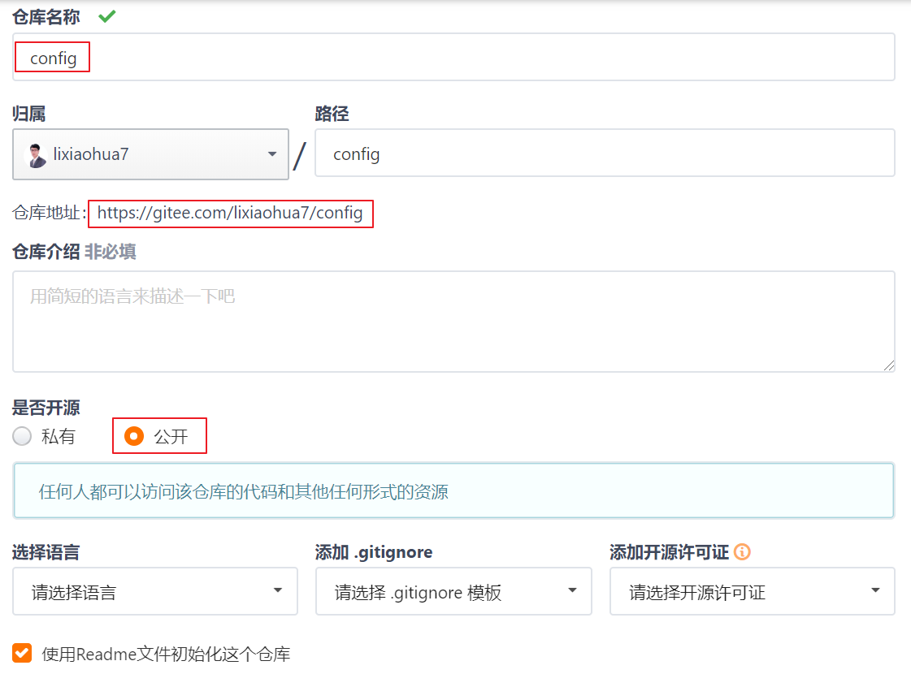

## 课程目标

目标1：能够使用Feign进行远程调用 

目标2：能够搭建Spring Cloud Gateway网关服务 

目标3：能够配置Spring Cloud Gateway路由过滤器 

目标4：能够编写Spring Cloud Gateway全局过滤器 

目标5：能够搭建Spring Cloud Config配置中心服务 

目标6：能够使用Spring Cloud Bus实时更新配置 


## 01、Feign：介绍与使用

在前面的学习中，使用了Ribbon的负载均衡功能，大大简化了远程调用时的代码： 

```java
// 定义服务实例访问URL
String url = "http://user-service/user/" + id;
return restTemplate.getForObject(url, String.class);
```

但是我们要思考一个问题? **微服务 与 微服务 之间调用问题**

+ 调用URL问题 (我们自已拼接，代码不够优雅)
+ 请求参数问题 (我们自己封装请求参数？如果请求参数多，封装起来就会变得特别麻烦，何况不同的请求封装请求参数格式还不一样)
+ 响应数据问题 (我们自已需要对响应数据进行转换，这个也是一个麻烦的事情)

这就是我们接下来要学习Feign的目的，它可以把这些问题全部伪装成一个Feign的http客户端接口，默认集成RestTemplate。**Feign存在的目的就是为了简化微服务之间的调用**。 

### 1.1 介绍

Feign也叫伪装： 

&nbsp;

Feign可以把Rest的请求进行隐藏，伪装SpringMVC的Controller一样。你不用再自己拼接url，拼接参数等等操作，一切的一切都交给Feign去做。(从而简化java语言http客户端远程调用问题) 

项目主页：https://github.com/OpenFeign/feign 


### 1.2 使用【掌握】

**目标**

> 使用Feign客户端调用微服务

**操作步骤**

+ 配置依赖(在user-consumer中添加如下依赖):

  ```xml
  <!-- 配置openfeign启动器 -->
  <dependency>
      <groupId>org.springframework.cloud</groupId>
      <artifactId>spring-cloud-starter-openfeign</artifactId>
  </dependency>
  ```

+ 编写Feign的客户端(在user-consumer中编写Feign客户端接口类):

  ```java
  package cn.itcast.consumer.client;
  
  import cn.itcast.consumer.pojo.User;
  import org.springframework.cloud.openfeign.FeignClient;
  import org.springframework.web.bind.annotation.GetMapping;
  import org.springframework.web.bind.annotation.PathVariable;
  
  @FeignClient("user-service")
  public interface UserClient {
  
      @GetMapping("/user/{id}")
      User findOne(@PathVariable("id") Long id);
  }
  ```
  + Feign客户端必须是一个接口，Feign会通过动态代理，创建接口代理对象。

  + @FeignClient注解，声明一个Feign客户端，value或name属性指定服务id。

  + Feign客户端接口中的方法，完全采用SpringMVC的注解，Feign会根据SpringMVC的注解生成请求URL，封装请求参数，并实现http远程调用，得到调用结果。

+ 编写控制器(定义新的控制器类ConsumerFeignController，使用UserClient访问): 

  ```java
  package cn.itcast.consumer.controller;
  
  import cn.itcast.consumer.client.UserClient;
  import cn.itcast.consumer.pojo.User;
  import lombok.extern.slf4j.Slf4j;
  import org.springframework.beans.factory.annotation.Autowired;
  import org.springframework.web.bind.annotation.GetMapping;
  import org.springframework.web.bind.annotation.PathVariable;
  import org.springframework.web.bind.annotation.RequestMapping;
  import org.springframework.web.bind.annotation.RestController;
  
  @RestController
  @RequestMapping("/cf")
  public class ConsumerFeignController {
      @Autowired(required = false)
      private UserClient userClient;
      
      @GetMapping("/{id}")
      public User findOne(@PathVariable("id") Long id){
          return userClient.findOne(id);
      }
  }
  ```

+ 开启Feign的支持(在ConsumerApplication启动类上，添加@EnableFeignClients注解):

  ```java
  package cn.itcast.consumer;
  
  import org.springframework.boot.SpringApplication;
  import org.springframework.cloud.client.SpringCloudApplication;
  import org.springframework.cloud.client.loadbalancer.LoadBalanced;
  import org.springframework.cloud.openfeign.EnableFeignClients;
  import org.springframework.context.annotation.Bean;
  import org.springframework.web.client.RestTemplate;
  
  /** @SpringBootApplication
   @EnableDiscoveryClient
   @EnableCircuitBreaker */
  @SpringCloudApplication
  @EnableFeignClients // 开启Feign客户端
  public class ConsumerApplication {
      public static void main(String[] args){
          SpringApplication.run(ConsumerApplication.class, args);
      }
      @Bean
      @LoadBalanced
      public RestTemplate restTemplate(){
          return new RestTemplate();
      }
  }
  ```

  > 说明：Feign中已经自动集成了Ribbon负载均衡，因此不需要自己定义RestTemplate进行负载均衡的配置。 

+ 启动测试: 访问地址 http://localhost:8080/cf/1

   


### 1.3、Feign：Ribbon的支持

+ Feign中本身已经集成了Ribbon依赖和自动配置:

  

+ Fegin内置的Ribbon默认设置了请求超时时长，可以通过手动配置来修改这个超时时长：

  ```properties
  ribbon:
    ConnectTimeout: 2000 # 建立链接的超时时长(默认,注意这是链接微服务超时时间,不能更改)
    ReadTimeout: 1000 # 读取响应数据超时时长(默认,注意这是调用微服务获取响应数据超时时间)
  ```

+ Fegin集成Ribbon时**增加了服务节点重试机制**，一旦超时，会自动向下一个服务节点重新发起请求。

  ```properties
  ribbon:
    ConnectTimeout: 2000 # 建立链接的超时时长(默认,注意这是链接微服务超时时间,不能更改)
    ReadTimeout: 2100 # 读取响应数据超时时长(注意这是调用微服务获取响应数据超时时间)
    MaxAutoRetries: 0 # 当前服务器的重试次数(默认)
    MaxAutoRetriesNextServer: 1 # 重试多少个服务节点(默认)
    OkToRetryOnAllOperations: false # 是否对所有的请求方式都重试(只对查询)(默认)
  ```

  > 注意：Hystrix线程隔离的超时时间，应该比重试的总时间要大，比如当前案例中，应该配 大于等于 2100*2(当前节点 + 重试的节点) = 4200(链接时间不计算在内，如果都不能链接，谈何线程隔离) **Fegin默认是关闭了Hystrix的支持(需要开启才有效)**

  ```properties
  # 线程隔离
  hystrix:
    command:
      default:
        execution:
          isolation:
            thread:
              timeoutInMilliseconds: 4200
  ```

  说明：com.netflix.client.config.DefaultClientConfigImpl.java类中的默认配置

   

   

  

### 1.4、Feign：Hystrix的支持

+ Feign默认也有对Hystrix做了集成(只不过，默认情况下是关闭的):

   

+ 需要通过下面的参数来开启:

  ```properties
  feign:
    hystrix:
      enabled: true # 开启Feign的功能(线程隔离与熔断) 
  ```

+ Feign的fallback服务降级(Feign的fallback不像Hystrix，因为Feign客户端是一个接口)

  + 定义UserClientFallback实现类，实现UserClient客户端接口，作为服务降级处理类

    ```java
    package cn.itcast.consumer.client.fallback;
    
    import cn.itcast.consumer.client.UserClient;
    import cn.itcast.consumer.pojo.User;
    import org.springframework.stereotype.Component;
    
    @Component
    public class UserClientFallback implements UserClient {
        @Override
        public User findOne(Long id) {
            User user = new User();
            user.setId(1L);
            user.setName("用户异常");
            return user;
        }
    }
    ```

  + 然后在UserClient客户端接口中指定服务降级处理类

    ```java
    @FeignClient(value = "user-service", fallback = UserClientFallback.class)
    public interface UserClient {
        @GetMapping("/user/{id}")
        User findOne(@PathVariable("id") Long id);
    }
    ```

  + 重启测试(关闭user-service服务，然后在页面访问):

    &nbsp;

### 1.5、Feign：日志级别【了解】

前面讲过，通过 logging.level.xx=debug 来设置日志级别。然而这个对Fegin客户端而言不会产生效果。Fegin的日志由fegin.Logger.Level实例来输出。我们只需要创建一个fegin.Logger.Level日志级别实例即可。

+ 在user-consumer的配置文件中设置cn.itcast包下的日志级别都为debug

  ```properties
  logging:
    level:
      cn.itcast: debug
  ```

+ 在user-consumer启动类中，定义fegin.Logger.Level实例

  ```java
  @SpringCloudApplication
  @EnableFeignClients // 开启Feign客户端
  public class ConsumerApplication {
      
      public static void main(String[] args){
          // 运行spring应用
          SpringApplication.run(ConsumerApplication.class, args);
      }
      @Bean
      @LoadBalanced // 负载均衡注解
      public RestTemplate restTemplate(){
          return new RestTemplate();
      }
      // Feign日志级别
      @Bean
      public Logger.Level feignLoggerLevel(){
          return Logger.Level.FULL;
      }
  }
  ```

  这里指定的Level级别是FULL，feign.Logger.Level支持4种级别： 

  + NONE：不记录任何日志信息，这是默认值。 
  + BASIC：仅记录请求的方法，URL以及响应状态码和执行时间 
  + HEADERS：在BASIC的基础上，额外记录了请求和响应的头信息 
  + FULL：记录所有请求和响应的明细，包括请求头、请求体、响应头、响应体。 

+ 重启项目，Fegin客户端调用微服时，就可以输出访问的日志:

  

## 02、Gateway：网关介绍

官网学习地址：<https://spring.io/projects/spring-cloud-gateway#learn>

> Spring Cloud Gateway简介

+ Gateway基于Spring 5.0、Spring Boot 2.0、WebFlux、Netty等技术开发的网关服务。 
+ Gateway基于Filter链提供网关基本功能：断言、路由、过滤、监控、限流等。 
+ Gateway为微服务架构提供简单、有效、统一的API路由管理方式。 
+ Gateway是替代Netflix公司Zuul的一套解决方案。 

Spring Cloud Gateway组件的核心是一系列的过滤器，通过这些过滤器可以将客户端发送的请求转发（路由）到对应的微服务。 Spring Cloud Gateway是加在整个微服务最前面的防火墙和代理器，隐藏微服务节点IP与端口信息，从而达到保护微服务的目的。Spring Cloud Gateway本身也是一个微服务，需要注册到Eureka服务注册中心。

Geteway网关的核心功能是：**路由、断言、过滤器**

> Geteway加入后的架构


说明：不管是来自于客户端（PC或移动端）的请求，还是服务内部调用。一切对服务的请求都可经过网关，然后再由网关来实现鉴权、动态路由等等操作。Gateway就是我们微服务调用的统一入口。 

> Gateway核心概念

+ **路由（route）**路由信息的组成: 由一个ID、一个目标URI、一组断言工厂、一组过滤器组成。如果断言为真，该请求就会 路由到 目标URI。 
+ **断言（Predicate）**用断言工厂去匹配请求URL。如果能匹配，断言为真。

+ **过滤器（Filter）**用过滤器过滤请求，包括: 过滤请求URL、过滤请求参数、过滤请求头等。

### 2.1、Gateway：快速入门

**创建模块**

+ 填写基本信息

  

  

+ 添加依赖

  ```xml
  <?xml version="1.0" encoding="UTF-8"?>
  <project xmlns="http://maven.apache.org/POM/4.0.0"
           xmlns:xsi="http://www.w3.org/2001/XMLSchema-instance"
           xsi:schemaLocation="http://maven.apache.org/POM/4.0.0
           http://maven.apache.org/xsd/maven-4.0.0.xsd">
      <parent>
          <artifactId>SpringCloud-demo</artifactId>
          <groupId>cn.itcast</groupId>
          <version>1.0-SNAPSHOT</version>
      </parent>
      <modelVersion>4.0.0</modelVersion>
      <artifactId>gateway-server</artifactId>
  
      <dependencies>
          <!-- 配置eureka客户端启动器 -->
          <dependency>
              <groupId>org.springframework.cloud</groupId>
              <artifactId>spring-cloud-starter-netflix-eureka-client</artifactId>
          </dependency>
          <!-- 配置gateway启动器(基于netty运行，所以不需要tomcat启动器) -->
          <dependency>
              <groupId>org.springframework.cloud</groupId>
              <artifactId>spring-cloud-starter-gateway</artifactId>
          </dependency>
      </dependencies>
  </project>
  ```

**编写启动类**

在gateway-server中创建cn.itcast.GatewayApplication启动类

```java
package cn.itcast;

import org.springframework.boot.SpringApplication;
import org.springframework.boot.autoconfigure.SpringBootApplication;
import org.springframework.cloud.client.discovery.EnableDiscoveryClient;

@SpringBootApplication
@EnableDiscoveryClient
public class GatewayApplication {
    public static void main(String[] args){
        SpringApplication.run(GatewayApplication.class, args);
    }
}
```

**编写配置**

在gateway-server中创建application.yml文件，内容如下：

```properties
server:
  port: 10010
spring:
  application:
    name: api-gateway

eureka:
  client:
    service-url:
      defaultZone: http://localhost:8761/eureka,http://localhost:8762/eureka
```

**编写路由规则**

+ 启动三个Spring Boot应用:

   

+ 需要用网关来代理user-service服务，先看一下控制面板中的服务状态:

  

+ 修改gateway-server的application.yml文件为(GatewayProperties.java):

  ```properties
  server:
    port: 10010
  spring:
    application:
      name: api-gateway
    cloud:
      gateway:
        routes:
          # 路由id,可以随意写
          - id: user-service-route
            # 路由的服务地址
            uri: http://127.0.0.1:9001
            # 断言，Path: 配置路由映射路径
            predicates:
              - Path=/user/**
  
  eureka:
    client:
      service-url:
        defaultZone: http://localhost:8761/eureka,http://localhost:8762/eureka
  ```

  + 将符合 Path 规则的一切请求，都代理或路由到 uri 参数指定的地址 
  + 本例中，我们将路径中包含有 /user/** 开头的请求，代理到http://127.0.0.1:9001 

**启动测试**

访问的路径中需要加上配置规则的映射路径，我们访问：http://localhost:10010/user/1


### 2.2、Gateway：面向服务路由

在刚才的路由规则中，把路径对应的服务地址写死了！如果同一服务有多个实例的话，这样做显然不合理。 应该根据服务的id，去Eureka注册中心查找服务对应的所有实例列表，然后进行动态路由！ 

+ 修改映射配置，通过服务名称获取

  因为已经配置了Eureka客户端，可以从Eureka获取服务的地址信息。修改application.yml文件： 

  ```properties
  server:
    port: 10010
  spring:
    application:
      name: api-gateway
    cloud:
      gateway:
        routes:
          # 路由id,可以随意写
          - id: user-service-route
            # 代理的服务地址；lb表示负载均衡(从eureka中根据服务id获取服务实例)
            uri: lb://user-service
            # 断言，Path: 配置路由映射路径
            predicates:
              - Path=/user/**
  
  eureka:
    client:
      service-url:
        defaultZone: http://localhost:8761/eureka,http://localhost:8762/eureka
  ```

  > 路由配置中uri所用的协议为lb时（以uri: lb://user-service为例），gateway将使用 LoadBalancerClient把user-service通过eureka解析为实际的主机和端口，并进行ribbon负载均衡。

  

+ 启动测试

  再次启动，这次gateway进行代理时，会利用Ribbon进行负载均衡访问：

  

  > 说明: spring-cloud-gateway网关服务，默认就已经集成了Ribbon负载均衡(轮询算法) 


### 2.3、Gateway：路由前缀

**添加前缀**

在gateway中可以通过配置网关过滤器PrefixPath，实现映射路径中的地址添加前缀，修改application.yml文件：

```properties
server:
  port: 10010
spring:
  application:
    name: api-gateway
  cloud:
    gateway:
      routes:
        # 路由id,可以随意写
        - id: user-service-route
          # 代理的服务地址；lb表示负载均衡(从eureka中根据服务id获取服务实例)
          uri: lb://user-service
          # 断言，配置路由映射路径
          predicates:
            - Path=/**
          filters:
            # 添加前缀: 指定路由路径需要添加的前缀
            - PrefixPath=/user

eureka:
  client:
    service-url:
      defaultZone: http://localhost:8761/eureka,http://localhost:8762/eureka
```

通过 **PrefixPath=/xxx** 来指定了路由要添加的前缀。

+ PrefixPath=/user http://localhost:10010/1 => http://localhost:9001/user/1 

+ PrefixPath=/user/abc http://localhost:10010/1 => http://localhost:9001/user/abc/1 以此类推。

  

**去除前缀**

在gateway中可以通过配置网关过滤器StripPrefix，实现映射路径中的地址去除前缀，修改application.yml文件：

```properties
server:
  port: 10010
spring:
  application:
    name: api-gateway
  cloud:
    gateway:
      routes:
        # 路由id,可以随意写
        - id: user-service-route
          # 代理的服务地址；lb表示负载均衡(从eureka中根据服务id获取服务实例)
          uri: lb://user-service
          # 断言，Path: 配置路由映射路径
          predicates:
            - Path=/api/user/**
          filters:
            # 去除前缀: 1去除一个前缀，2去除两个前缀，以此类推
            - StripPrefix=1

eureka:
  client:
    service-url:
      defaultZone: http://localhost:8761/eureka,http://localhost:8762/eureka
```

通过 StripPrefix=1 来指定了路由要去掉的前缀个数。如：路径 /api/user/1 将会被代理到 /user/1。 

+ StripPrefix=1 http://localhost:10010/api/user/1 => http://localhost:9001/user/1
+ StripPrefix=2 http://localhost:10010/api/user/1 => http://localhost:9001/1

 以此类推。

 

### 2.4、Gateway：过滤器介绍

> 过滤器简介

Gateway作为网关的其中一个重要功能，就是实现请求的鉴权。而这个动作往往是通过网关提供的过滤器来实现的。前面的 路由前缀 章节中的功能也是使用过滤器实现的。

+ Gateway自带过滤器有30多个，常见自带过滤器有：

  | 过滤器名称           | 说明                         |
  | :------------------- | :--------------------------- |
  | AddRequestHeader     | 对匹配上的请求添加Header     |
  | AddRequestParameters | 对匹配上的请求添加参数       |
  | AddResponseHeader    | 对从网关返回的响应添加Header |
  | StripPrefix          | 对匹配上的请求路径去除前缀   |

  

  详细的说明在: <a href='https://cloud.spring.io/spring-cloud-static/spring-cloud-gateway/2.2.0.RC1/reference/html/#gatewayfilter-factories'>官网链接</a>

+ 过滤器类型: Gateway有两种类型的过滤器

  + 全局过滤器：自定义全局过滤器,需实现 GlobalFilter、Ordered两个接口。不需要在配置文件中配置，作用在所有的路由上。
  + 局部过滤器：通过spring.cloud.routes.filters 配置在具体路由下，只作用在当前路由上,自带的30几个过滤器都可以配置。

> 过滤器执行生命周期

Spring Cloud Gateway 的 Filter 的生命周期有两个(前置过滤与后置过滤)：“pre” 和 “post”。“pre”和 “post” 分别会在请求执行前调用 或 请求执行后调用。

&nbsp;

过滤器使用场景(例举):

+ 请求鉴权: 一般在请求执行前，如果发现没有访问权限，直接就拦截返回空。 
+ 异常处理: 一般在请求执行后，记录异常并返回。 
+ 服务调用时长统计: 在请求执行前记录时间，在请求执行后计算该服务的调用时间。 

### 2.5、Gateway：配置默认过滤器

我们可以将Spring Cloud Gateway自带的过滤器配置成默认过滤器: 不是针对一个路由；而是对全部路由有效。

```properties
server:
  port: 10010
spring:
  application:
    name: api-gateway
  cloud:
    gateway:
      # 默认过滤器，对全部路由有效
      default-filters:
        # 添加响应头过滤器，添中一个响应头为name，值为admin
        - AddResponseHeader=name,admin
      routes:
        # 路由id,可以随意写
        - id: user-service-route
          # 代理的服务地址；lb表示负载均衡(从eureka中根据服务id获取服务实例)
          uri: lb://user-service
          # 断言，Path: 配置路由映射路径
          predicates:
            - Path=/api/user/**
          filters:
            # 去除前缀: 1去除一个前缀，2去除两个前缀，以此类推
            - StripPrefix=1

eureka:
  client:
    service-url:
      defaultZone: http://localhost:8761/eureka,http://localhost:8762/eureka
```

运行测试:


### 2.6、Gateway：自定义全局过滤器

> 需求：模拟一个登录的校验。基本逻辑：如果请求中有token参数，则认为请求有效，放行。 

+ 在gateway-server模块中编写全局过滤器: MyGlobalFilter

  ```java
  package cn.itcast.filter;
  
  import org.apache.commons.lang.StringUtils;
  import org.springframework.cloud.gateway.filter.GatewayFilterChain;
  import org.springframework.cloud.gateway.filter.GlobalFilter;
  import org.springframework.core.Ordered;
  import org.springframework.http.HttpStatus;
  import org.springframework.stereotype.Component;
  import org.springframework.web.server.ServerWebExchange;
  import reactor.core.publisher.Mono;
  
  /** 自定义全局过滤器 */
  @Component
  public class MyGlobalFilter implements GlobalFilter, Ordered {
      @Override
      public Mono<Void> filter(ServerWebExchange exchange, GatewayFilterChain chain) {
          System.out.println("==全局过滤器MyGlobalFilter==");
          String token = exchange.getRequest().getQueryParams().getFirst("token");
          if (StringUtils.isBlank(token)){
              // 设置响应状态码: 401 未授权
              exchange.getResponse().setStatusCode(HttpStatus.UNAUTHORIZED);
              // 返回响应完成
              return exchange.getResponse().setComplete();
          }
          // 放行
          return chain.filter(exchange);
      }
      @Override
      public int getOrder() {
          // 值越小越先执行
          return 1;
      }
  }
  ```

+ 测试访问

  + 访问 http://localhost:10010/api/user/1

    

  + 访问 http://localhost:10010/api/user/1?token=abc

     


### 2.7、Gateway：集成Hystrix

> 目标: spring-cloud-gateway集成Hystrix实现线程隔离。

- 第一步: 在gateway-server中，添加hystrix启动器

  ```xml
  <!-- 配置hystrix启动器 -->
  <dependency>
      <groupId>org.springframework.cloud</groupId>
      <artifactId>spring-cloud-starter-netflix-hystrix</artifactId>
  </dependency>
  ```

- 第二步: 配置线程隔离时间

  ```properties
  # 线程隔离
  hystrix:
    command:
      default:
        execution:
          isolation:
            thread:
              timeoutInMilliseconds: 1000
  ```

- 第三步: 在默认过滤器中配置Hystrix过滤器(对全部路由有效)

  ```properties
  spring:
    cloud:
      gateway:
        # 配置默认过滤器(对全部路由有效)
        default-filters:
        # 添加响应头，响应头的名称为name 值为admin
        - AddResponseHeader=name,admin
        - name: Hystrix  # 配置Hystrix过滤器
          args:          # 配置两个参数
            name: fallbackcmd
            fallbackUri: forward:/fallback
  ```

- 第四步: 创建FallbackController.java控制器，提供服务降级方法

  ```java
  package cn.itcast.controller;
  import org.springframework.web.bind.annotation.GetMapping;
  import org.springframework.web.bind.annotation.RestController;
  
  @RestController
  public class FallbackController {
      @GetMapping("/fallback")
      public String fallback(){
          return "您好，服务器正忙，请稍候再试。。。";
      }
  }
  ```

- 第五步: 测试

   

### 2.8、Gateway：高可用【了解】 

+ 启动多个Gateway服务，自动注册到Eureka，就可以形成集群。

  + 如果是微服务内部访问Gateway，自动负载均衡(Ribbon)。 

  + Gateway更多是外部访问，PC端、移动端等。它们无法通过Ribbon进行负载均衡，那么该怎么办？

    此时，可以使用其它的服务网关，来对Gateway做负载均衡。比如:【Nginx、Apache】

  

+ Gateway与Feign的区别

  + Gateway 作为整个应用的入口，接收所有的请求，如PC、移动端等，并且将不同的请求路由至不同的微服务，大部分情况下用作权限鉴定、流量控制。
  + Feign 主要用于微服务与微服务之间的调用。 


10、Zuul：服务网关介绍


官网：https://github.com/Netflix/zuul

 

Zuul：维基百科：

电影《捉鬼敢死队》中的怪兽，Zuul，在纽约引发了巨大骚乱。

事实上，在微服务架构中，Zuul就是守门的大Boss！一夫当关，万夫莫开！


Zuul的作用，保护后台所有微服务！


 


加入了Zuul网关后的微服务架构：

 


Zuul 网关  vs  Nginx

相同点：

1）负载均衡

2）限流/流量分发


不同点：

1）定位不同：

​      Nginx：用于静态资源请求处理的

​     Zuul网关：用于动态资源请求处理的

2）权限控制，Nginx很弱，Zuul网关很强

3）负载均衡配置，Nginx不灵活，Zuul网关可以和Eureka结合，负载均衡更加灵活


## 03、Zuul：快速入门（动态路由）

==开发步骤：==

- 导入依赖
- 启动类中开启Zuul的使用
- 配置路由规则


==核心代码：==

- 导入依赖

  ```xml
  	<parent>
  		<groupId>org.springframework.boot</groupId>
  		<artifactId>spring-boot-starter-parent</artifactId>
  		<version>2.0.1.RELEASE</version>
  		<relativePath />
  	</parent>
  
  	<properties>
  		<project.build.sourceEncoding>UTF-8</project.build.sourceEncoding>
  		<project.reporting.outputEncoding>UTF-8</project.reporting.outputEncoding>
  		<java.version>1.8</java.version>
  		<!-- SpringCloud版本，F系列 -->
  		<spring-cloud.version>Finchley.RC1</spring-cloud.version>
  	</properties>
  
  	<dependencies>
  		<dependency>
  			<groupId>org.springframework.cloud</groupId>
  			<artifactId>spring-cloud-starter-netflix-zuul</artifactId>
  		</dependency>
  	</dependencies>
  
  	<dependencyManagement>
  		<dependencies>
  		<!-- SpringCloud依赖，一定要放到dependencyManagement中，起到管理版本的作用即可 -->
  			<dependency>
  				<groupId>org.springframework.cloud</groupId>
  				<artifactId>spring-cloud-dependencies</artifactId>
  				<version>${spring-cloud.version}</version>
  				<type>pom</type>
  				<scope>import</scope>
  			</dependency>
  		</dependencies>
  	</dependencyManagement>
  
  	<repositories>
  		<repository>
  			<id>spring-milestones</id>
  			<name>Spring Milestones</name>
  			<url>https://repo.spring.io/milestone</url>
  			<snapshots>
  				<enabled>false</enabled>
  			</snapshots>
  		</repository>
  	</repositories>
  
  ```

- 启动类中开启Zuul的使用

  ```java
  @SpringBootApplication
  @EnableZuulProxy //开启代理
  public class ZuulDemoApplication {
  
  	public static void main(String[] args) {
  		SpringApplication.run(ZuulDemoApplication.class, args);
  	}
  
  }
  ```

- 配置路由规则

  ```yml
  zuul:
    routes:
      feifei:
        path: /user-service/**
        url: http://127.0.0.1:9001
  ```

  


### 3.1、Zuul：面向服务的路由

在刚才的路由规则中，我们把路径对应的服务地址写死了，如果同一服务有多个实例的话，这样做显然就不合理了。

我们应该根据服务的名称，去Eureka注册中心查找 服务对应的所有实例列表，然后进行动态路由才对。

添加eureka客户端

- ```xml
<dependency>
      <groupId>org.springframework.cloud</groupId>
      <artifactId>spring-cloud-starter-netflix-eureka-client</artifactId>
  </dependency>
  ```
  
  

- 开启Eureka客户端发现功能：在启动类中加入如下注解

  ```java
  @EnableDiscoveryClient 或 @EnableEurekaClient
  ```

- 添加Eureka配置，获取服务信息

  ```yml
  eureka:
    client:
      service-url:
        defaultZone: http://127.0.0.1:10086/eureka
  ```

- 修改映射配置，通过服务名称获取

  ```yml
  zuul:
    routes:
      feifei: # 这里是路由id，随意写
        path: /user-service/** # 这里是映射路径
        serviceId: user-service # 指定服务名称
  ```

  

### 3.2、Zuul：默认路由规则及禁用路由

==默认路由规则：==

在刚才的配置中，我们的规则是这样的：

- `zuul.routes.<route>.path=/xxx/**`： 来指定映射路径。`<route>`是自定义的路由名
- `zuul.routes.<route>.serviceId=/user-service`：来指定服务名。

而大多数情况下，我们的`<route>`路由名称往往和 服务名会写成一样的。因此Zuul就提供了一种简化的配置语法：`zuul.routes.<serviceId>=<path>`

比方说上面我们关于user-service的配置可以简化为一条：

```yaml
zuul:
  routes:
    user-service: /user-service/** # 这里是映射路径
```

省去了对服务名称的配置。


在用Zuul的过程中，上面讲述的规则已经大大的简化了配置项。但是当服务较多时，配置也是比较繁琐的。因此Zuul就指定了默认的路由规则：

- 默认情况下，一切服务的映射路径就是服务名本身。
  - 例如服务名为：`user-service`，则默认的映射路径就是：`/user-service/**`

也就是说，刚才的映射规则我们完全不配置也是OK的，不信就试试看。


==== 禁用路由： ====

如果想要禁用某个路由规则，可以这样：

```yaml
zuul:
  ignored-services:
    - user-service
    - consumer
```


### 3.3、Zuul：路由的前缀


```yaml
zuul:
  prefix: /api # 添加全局路由前缀
  routes:
    user-service: /user-service/** # 这里是映射路径
```


### 3.4、Zuul：Zuul过滤器介绍

==**Zuul过滤器介绍：**==

Zuul作为网关的其中一个重要功能，就是实现请求的鉴权。而这个动作我们往往是通过Zuul提供的过滤器来实现的。

ZuulFilter是过滤器的顶级父类。在这里我们看一下其中定义的4个最重要的方法：

```java
public abstract class ZuulFilter implements IZuulFilter{

    abstract public String filterType();

    abstract public int filterOrder();
    
    boolean shouldFilter();// 来自IZuulFilter

    Object run() throws ZuulException;// IZuulFilter
}
```

- `shouldFilter`：返回一个`Boolean`值，判断该过滤器是否需要执行。返回true执行，返回false不执行。

- `run`：过滤器的具体业务逻辑。

- `filterType`：返回字符串，代表过滤器的类型。包含以下4种：
  
  - `pre`：请求在被路由之前执行
  - `route`：在路由请求时调用
  - `post`：在routing和errror过滤器之后调用
  - `error`：处理请求时发生错误调用
  
- `filterOrder`：通过返回的int值来定义过滤器的执行顺序，数字越小优先级越高。

  

==**过滤器执行生命周期：**==

这张是Zuul官网提供的请求生命周期图，清晰的表现了一次请求在各个过滤器的执行顺序。


- 正常流程：
  
  - 请求到达首先会经过pre类型过滤器，而后到达routing类型，进行路由，请求就到达真正的服务提供者，执行请求，返回结果后，会到达post过滤器。而后返回响应。
- 异常流程：
  - 整个过程中，pre或者routing过滤器出现异常，都会直接进入error过滤器，再error处理完毕后，会将请求交给POST过滤器，最后返回给用户。
  
  - 如果是error过滤器自己出现异常，最终也会进入POST过滤器，而后返回。
  
  - 如果是POST过滤器出现异常，会跳转到error过滤器，但是与pre和routing不同的时，请求不会再到达POST过滤器了。
  
    

==**场景非常多：**==

- 请求鉴权：一般放在pre类型，如果发现没有访问权限，直接就拦截了
- 异常处理：一般会在error类型和post类型过滤器中结合来处理。
- 服务调用时长统计：pre和post结合使用
- 限流：一般在pre类型。


### 3.5、Zuul：自定义过滤器

==**核心代码：**==

```java
package com.itheima.gateway.filter;

import javax.servlet.http.HttpServletRequest;

import org.springframework.cloud.netflix.zuul.filters.support.FilterConstants;
import org.springframework.stereotype.Component;

import com.netflix.zuul.ZuulFilter;
import com.netflix.zuul.context.RequestContext;
import com.netflix.zuul.exception.ZuulException;

/**
 * 权限过滤器
 *
 */
@Component
public class AuthFilter extends ZuulFilter{

	//过滤器类型
	//pre:前置
	//route：路由
	//post:后置
	//error：异常
	@Override
	public String filterType() {
		return FilterConstants.PRE_TYPE;
	}

	//过滤器顺序，数值越大，优先级越低
	@Override
	public int filterOrder() {
		return 0;
	}
	
	//是否执行run
	@Override
	public boolean shouldFilter() {
		return true;
	}

	//执行逻辑
	@Override
	public Object run() throws ZuulException {
		
		//1.获取请求的token参数
		RequestContext requestContext = RequestContext.getCurrentContext();
		HttpServletRequest request = requestContext.getRequest();
		
		String token = request.getParameter("token");
		
		//2.1 如果有token参数，继续执行后续请求（放行）
		if(token!=null) {
			//放行
			return null;		
		}
		
		//2.2 如果没有token参数，直接返回给用户，并且提示"权限不足，拒绝访问"
		requestContext.setSendZuulResponse(false); // 中断zuul请求
		//返回提示信息
		requestContext.setResponseBody("权限不足，拒绝访问");
		//设置响应编码
		requestContext.getResponse().setContentType("text/html;charset=utf-8");
		return null; //注意：如果先执行requestContext.setSendZuulResponse(false)代码，return nuul无效了
	}
}
```

测试，没有带token，返回401；如果带了token正常访问


### 3.6、Zuul：负载均衡和熔断

Zuul中默认就已经集成了Ribbon负载均衡和Hystix熔断机制。但是所有的超时策略都是走的默认值，比如熔断超时时间只有1S，很容易就触发了。因此建议我们手动进行配置：

```yml
ribbon:
  ReadTimeout: 2000 # 读取超时时长
  ConnectTimeout: 1000 # 建立链接的超时时长
hystrix:
  command:
    default:
      execution:
        isolation:
          thread:
            timeoutInMilliseconds: 6000 # 熔断超时时长：6000ms
```

ribbon的连接超时时间 小于 Hystrix的熔断超时时间。


## 04、Config：配置中心介绍【了解】

在分布式系统中，由于微服务数量特别多，配置文件分散在不同的微服务中，不方便管理。为了更方便管理配置文件，就需要统一管理的配置中心。Spring Cloud 提供了Spring Cloud Config，它支持配置文件统一管理，可以把全部微服务的配置文件放在Git远程仓库（GitHub、码云）。

使用Spring Cloud Config配置中心后的架构如下图：


官网学习文档：<https://cloud.spring.io/spring-cloud-static/spring-cloud-config/2.2.0.RC1/reference/html/> 

> 配置中心本质上也是一个微服务，同样需要注册到Eureka服务注册中心！ 


### 4.1、Config：Git配置管理

远程Git**仓库**

+ 知名的Git远程仓库有: **国外的GitHub **和 **国内的码云 **但是使用GitHub时，国内的用户经常遇到的问题是访问速度太慢，有时候还会出现无法连接的情况。如果希望体验更好一些，可以使用国内的Git托管服务——码云。
+ 码云访问地址：https://gitee.com/


**创建远程仓库**

首先要使用码云上的私有远程git仓库需要先注册帐号；请先自行访问网站并注册帐号，然后使用帐号登录码云控制台并创建公开仓库。

&nbsp;



**创建配置文件**

在新建的仓库中创建需要被统一管理的配置文件。

**配置文件的命名方式：**

 {application}-{profile}.yml 或 {application}-{profile}.properties 

+ application为应用名称 
+ profile用来区分: 开发环境、测试环境、生产环境等。

如user-dev.yml，表示用户微服务开发环境下使用的配置文件。这里将user-service工程的配置文件application.yml文件的内容复制作为user-dev.yml文件的内容，具体配置如下：


创建完user-dev.yml配置文件之后，gitee中的仓库如下：


### 4.2、Config：搭建配置中心微服务

**创建模块**

+ 创建配置中心微服务模块

  

   

+ 添加依赖，修改pom.xml

  ```xml
  <?xml version="1.0" encoding="UTF-8"?>
  <project xmlns="http://maven.apache.org/POM/4.0.0"
           xmlns:xsi="http://www.w3.org/2001/XMLSchema-instance"
           xsi:schemaLocation="http://maven.apache.org/POM/4.0.0
           http://maven.apache.org/xsd/maven-4.0.0.xsd">
      <parent>
          <artifactId>SpringCloud-demo</artifactId>
          <groupId>cn.itcast</groupId>
          <version>1.0-SNAPSHOT</version>
      </parent>
      <modelVersion>4.0.0</modelVersion>
      <artifactId>config-server</artifactId>
      
      <dependencies>
          <!-- 配置eureka客户端启动器 -->
          <dependency>
              <groupId>org.springframework.cloud</groupId>
              <artifactId>spring-cloud-starter-netflix-eureka-client</artifactId>
          </dependency>
          <!-- 配置config服务端(依赖了web启动器) -->
          <dependency>
              <groupId>org.springframework.cloud</groupId>
              <artifactId>spring-cloud-config-server</artifactId>
          </dependency>
      </dependencies>
  </project>
  ```

**启动类**

创建配置中心模块config-server启动类ConfigServerApplication.java:

```java
package cn.itcast;

import org.springframework.boot.SpringApplication;
import org.springframework.boot.autoconfigure.SpringBootApplication;
import org.springframework.cloud.config.server.EnableConfigServer;

@SpringBootApplication
@EnableDiscoveryClient // 开启eureka客户端
@EnableConfigServer // 开启配置中心服务
public class ConfigServerApplication {
    
    public static void main(String[] args){
        SpringApplication.run(ConfigServerApplication.class, args);
    }
}
```

**配置文件**

创建配置中心工程config-server的配置文件application.yml:

MultipleJGitEnvironmentProperties.java属性类

```properties
server:
  port: 12000
  
spring:
  application:
    name: config-server
  cloud:
    config:
      server:
        git:
          uri: https://gitee.com/lixiaohua7/config.git
eureka:
  client:
    service-url:
      defaultZone: http://localhost:8761/eureka,http://localhost:8762/eureka
```

> 注意上面的 spring.cloud.config.server.git.uri 则是在码云创建的仓库地址

**启动测试**

启动eureka注册中心和配置中心，然后访问http://localhost:12000/user-dev.yml ，查看能否输出在码云存储管理的user-dev.yml文件。并且可以在gitee上修改user-dev.yml然后刷新上述测试地址也能及时到最新数据。


### 4.3、Config：获取配置中心配置

前面已经完成了配置中心微服务的搭建，下面我们就需要改造一下用户微服务user-service，配置文件信息不再由微服务项目提供，而是从配置中心获取。如下对user-service工程进行改造。

**添加依赖**

+ 在user-service模块中，添加如下依赖:

  ```xml
  <!-- 配置config启动器  -->
  <dependency>
    	<groupId>org.springframework.cloud</groupId>
    	<artifactId>spring-cloud-starter-config</artifactId>
  </dependency>
  ```

**修改配置**

+ 删除user-service模块中的application.yml文件（因为该文件从配置中心获取）

     说明：暂保留application.yml 更名为 temp.yml

+ 创建user-service模块bootstrap.yml配置文件(ConfigClientProperties.java)

  ```properties
  spring:
    cloud:
      config:
        # 与远程仓库中的配置文件的application保持一致
        name: user
        # 与远程仓库中的配置文件的profile保持一致
        profile: dev
        # 与远程仓库中的分支名保持一致
        label: master
        # 配置去哪里发现
        discovery:
          # 启用配置中心
          enabled: true
          # 配置中心服务id
          service-id: config-server
  # 配置eureka
  eureka:
    client:
      service-url: # EurekaServer地址,多个地址以','隔开
        defaultZone: http://localhost:8761/eureka,http://localhost:8762/eureka
  ```

  user-service模块，修改后的结构:

  &nbsp;

  + bootstrap.yml文件也是Spring Boot的默认配置文件，而且其加载的时间相比于application.yml更早。 
  + application.yml和bootstrap.yml虽然都是Spring Boot的默认配置文件，但是定位却不相同。bootstrap.yml可以理解成系统级别的一些参数配置，这些参数一般是不会变动的。application.yml可以用来定义应用级别的参数，如果搭配 spring cloud config 使用，application.yml里面定义的文件可以实现动态替换。 
  + 总结就是：bootstrap.yml文件相当于项目启动时的引导文件，内容相对固定。application.yml文件是微服务的一些常规配置参数，变化比较频繁。

**启动测试**

启动注册中心、配置中心、用户服务user-service，如果启动没有报错其实已经使用上配置中心内容，可以到注册中心查看，也可以检验user-service的服务。


## 05、Spring Cloud Bus：消息总线介绍

> 存在问题

前面已经完成了将微服务中的配置文件集中存储在远程Git仓库，并且通过配置中心微服务从Git仓库拉取配置文件，当用户微服务启动时会连接配置中心获取配置信息从而启动用户微服务。如果我们更新Git仓库中的配置文件，那用户微服务是否可以及时接收到新的配置信息并更新呢？ 

> 测试是否更新Git仓库中的配置文件

+ 修改在码云上的user-dev.yml文件，添加一个属性test.name

   

+ 修改user-service工程中的UserController.java

  ```java
  package cn.itcast.user.controller;
  
  import cn.itcast.user.pojo.User;
  import cn.itcast.user.service.UserService;
  import org.springframework.beans.factory.annotation.Autowired;
  import org.springframework.beans.factory.annotation.Value;
  import org.springframework.web.bind.annotation.GetMapping;
  import org.springframework.web.bind.annotation.PathVariable;
  import org.springframework.web.bind.annotation.RequestMapping;
  import org.springframework.web.bind.annotation.RestController;
  
  @RestController
  @RequestMapping("/user")
  public class UserController {
  
      @Autowired
      private UserService userService;
      
      @Value("${test.name}")
      private String name;
  
      /** 根据主键id查询用户 */
      @GetMapping("/{id}")
      public User findOne(@PathVariable("id")Long id){
          System.out.println("配置文件中的test.name = " + name);
          return userService.findOne(id);
      }
  }
  ```

+ 启动测试

  + 依次启动Eureka、配置中心微服务、用户微服务、然后修改Git仓库中的配置信息，访问用户微服务，查看输出内容。http://localhost:9001/user/1

    

     

  + 结论：通过查看用户微服务控制台的输出结果可以发现，我们对于Git仓库中配置文件的修改并没有及时更新到用户微服务，只有重启用户微服务才能生效。【重启用户微服务效果】

    

  + 如果想在不重启微服务的情况下更新配置该如何实现呢? 可以使用Spring Cloud Bus来实现配置的自动更新。需要注意的是Spring Cloud Bus底层是基于RabbitMQ实现的，默认使用本地的消息队列服务，所以需要提前启动本地RabbitMQ服务。

> Spring Cloud Bus 消息总线介绍

Spring Cloud Bus是用轻量的消息代理将分布式的节点连接起来,可以用于广播配置文件的更改或者服务的监控管理。一个关键的思想就是,消息总线可以为微服务做监控,也可以实现应用程序之间相互通信。Spring Cloud Bus可选的消息代理有RabbitMQ和Kafka。

使用了Bus之后: 


### 5.1、Spring Cloud Bus：改造配置中心

+ 在config-server模块的pom.xml文件中加入Spring Cloud Bus相关依赖

  ```xml
  <!-- 配置spring-cloud-bus消息总线 -->
  <dependency>
      <groupId>org.springframework.cloud</groupId>
      <artifactId>spring-cloud-bus</artifactId>
  </dependency>
  <!-- 配置rabbit消息中间件 -->
  <dependency>
      <groupId>org.springframework.cloud</groupId>
      <artifactId>spring-cloud-stream-binder-rabbit</artifactId>
  </dependency>
  ```

+ 在config-server模块中修改application.yml文件

  RabbitProperties.java与WebEndpointProperties.java

  ```properties
  server:
    port: 12000
  
  spring:
    application:
      name: config-server
    cloud:
      config:
        server:
          git:
            uri: https://gitee.com/lixiaohua7/config.git
  
    # rabbitmq的配置信息；如下配置的rabbit都是默认值，其实可以完全不配置
    rabbitmq:
      host: localhost
      port: 5672
      username: guest
      password: guest
  
  eureka:
    client:
      service-url:
        defaultZone: http://localhost:8761/eureka,http://localhost:8762/eureka
  
  management:
    endpoints:
      web:
        exposure:
          # 暴露触发消息总线的地址(发送消息到rabbitmq)
          include: bus-refresh
  ```

### 5.2、Spring Cloud Bus：改造用户服务

+  在user-service模块的pom.xml中加入Spring Cloud Bus相关依赖

  ```xml
  <!-- 配置spring-cloud-bus消息总线 -->
  <dependency>
      <groupId>org.springframework.cloud</groupId>
      <artifactId>spring-cloud-bus</artifactId>
  </dependency>
  <!-- 配置rabbit消息中间件 -->
  <dependency>
      <groupId>org.springframework.cloud</groupId>
      <artifactId>spring-cloud-stream-binder-rabbit</artifactId>
  </dependency>
  <!-- 配置actuator监控管理springboot应用的启动器 -->
  <dependency>
      <groupId>org.springframework.boot</groupId>
      <artifactId>spring-boot-starter-actuator</artifactId>
  </dependency>
  ```

+ 修改user-service模块的bootstrap.yml

  ```properties
  spring:
    cloud:
      config:
        # 与远程仓库中的配置文件的application保持一致
        name: user
        # 与远程仓库中的配置文件的profile保持一致
        profile: dev
        # 与远程仓库中的版本保持一致
        label: master
        discovery:
          # 启用配置中心
          enabled: true
          # 配置中心服务id
          service-id: config-server
    # rabbitmq的配置信息；如下配置的rabbit都是默认值，其实可以完全不配置
    rabbitmq:
      host: localhost
      port: 5672
      username: guest
      password: guest
  
  # 配置eureka
  eureka:
    client:
      service-url: # EurekaServer地址,多个地址以','隔开
        defaultZone: http://localhost:8761/eureka,http://localhost:8762/eureka
  ```

+  改造user-service模块的UserController.java

   

+ 启动测试

  前面已经完成了配置中心微服务和用户微服务的改造，下面来测试一下，当我们修改了Git仓库中的配置文件，用户微服务是否能够在不重启的情况下自动更新配置信息。

  #### 测试步骤

  + 第一步：依次启动Eureka、配置中心微服务、用户微服务

  + 第二步：访问用户微服务查看输出结果

  + 第三步：修改Git仓库中配置文件内容

  + 第四步：使用Postman或者RESTClient工具发送POST方式，请求访问地址

    http://127.0.0.1:12000/actuator/bus-refresh

    

  + 第五步：访问用户微服务系统控制台查看输出结果

    

  #### 说明

  + Postman或者RESTClient是一个可以模拟浏览器发送各种请求（POST、GET、PUT、DELETE等）的工具。
  + 请求地址http://127.0.0.1:12000/actuator/bus-refresh中 /actuator是固定的,/bus-refresh对应的是配置中心config-server中的application.yml文件的配置项include的内容。
  + 请求http://127.0.0.1:12000/actuator/bus-refresh地址的作用是访问配置中心的消息总线服务，消息总线服务接收到请求后会向消息队列中发送消息，订单微服务会监听消息队列。当订单微服务接收到队列中的消息后，会重新从配置中心获取最新的配置信息。

### 5.3、Spring Cloud：技术体系综合应用


## 06、swagger

Swagger是一个 RESTFUL接口的文档在线自动生成和功能测试的框架；

Swagger是一个规范和完整的框架，用于生成、描述、调用和可视化 RestFul风格的Web服务。

## 07、课程总结

+ Feign：服务调用(微服务调用)
+ Spring Cloud Gateway: 服务网关(路由到微服务)
+ Spring Cloud Zuul
+ Spring Cloud Config: 配置中心(配置文件统一管理)
+ Spring Cloud Bus: 消息总线(服务之间配置文件同步)
+ swagger
