## zookeeper基础知识
### 什么是zookeeper
ZooKeeper是一个开源的分布式服务协同系统，由雅虎开发，后转赠给 Apache。
设计目的集中管理不太容易控制的分布式服务，组成一个高效可靠的集群服务。
Zookeeper提供一系列AP接口供业务方使用。

**主要应用场景**：配置服务、命名服务、集群管理、分布式锁、分布式队列

## zookeeper工作原理
### zookeeper数据同步机制
Zookeeper集群数据同步的核心是原子广播，这个机制保证了各个Server之间的数据同步一致性;

来自 Client的读请求，直接由对应 Server的本地副本来进行服务的;

来自 Client的写请求， Follower会把请求转给Leader处理，因为 Zookeeper要保证每台Server的本地副本是一致的，需要通过一致性协议来处理，实现这个机制的协议叫做Zab协议。

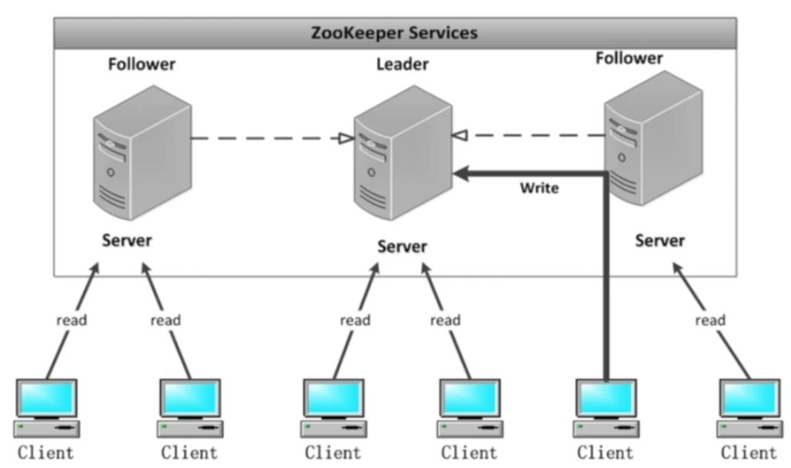

### zookeeper原子广播
#### zab协议概述
Zab协议是 Zookeeper为分布式协调服务专门设计的一种支持容错、崩溃、恢复的原子广播协议，是 Zookeeper保证数据一致性的核心算法。

1. zab协议需要确保那些已经在 Leader服务器上提交的事务最终被所有的服务器都提交。
2. zab协议需要确保丢弃那些只在 Leader上被提出而没有被提交的事务。

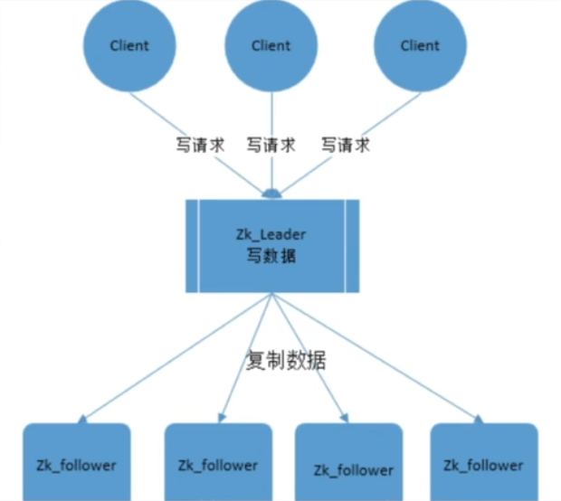

#### Zab协议详解

1. ZooKeeper follower Server收到 Client的写请求

2. 转发给 Leader处理

3. Leader节点先将更新持久化到本地

4. 然后将此次更新提议（ propose）给 Followers

5. Follower节点接收请求，成功将修改持久化到本地，发送一个ACK给 Leader

6. Leader接收到半数以上的ACK时， Leader将广播commit消息并在本地提交该消息

7. 当收到 Leader发来的 commity消息时， Follower也会提交该消息。

  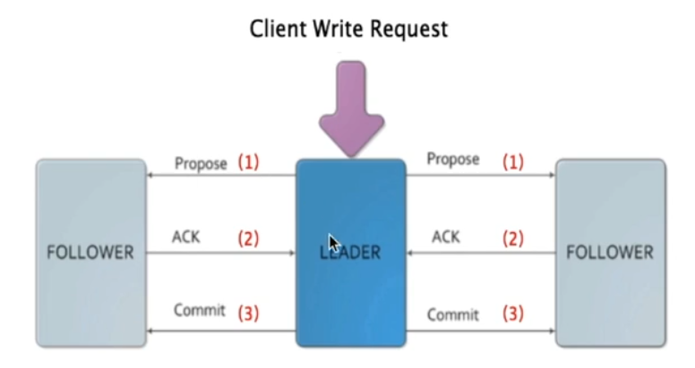

### zookeeper选举
#### zookeeper选举规则

- Follower参与投票
- 投票超过半数通过
- Observer不参与选举

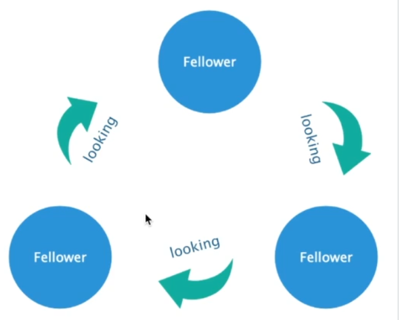

#### zookeeper选举指标
选举参数(Epoch,Zxid,Serverid)

- Epoch：逻辑时钟，也称为投票周期，值越大权重越大，优先级大于Zxid
- Z×id：全局事务id，值越大权重越大，优先级大于 Serverid 
- Serverid：服务器编号id，值越大权重越大

#### zookeeper集群初始选举
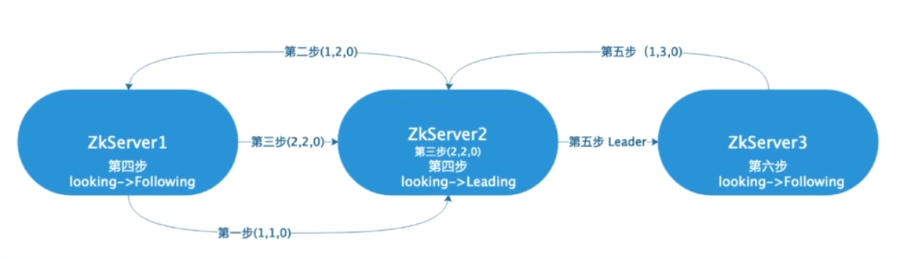

#### zookeeper运行期间重新选举
Leader节点服务宕机

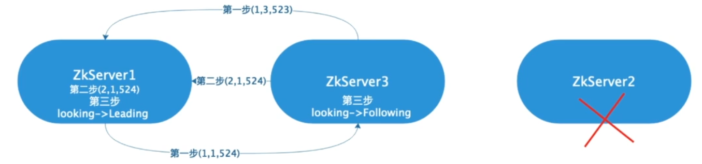

### 分布式同步锁
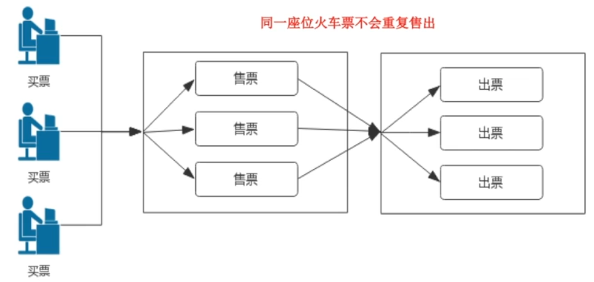

synchronized只能解决单个Java进程内线程同步的问题

#### zookeeper实现分布式锁的逻辑结构
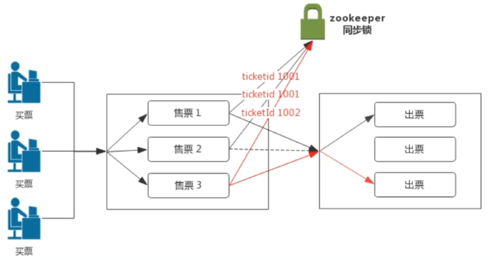

#### zookeeper实现分布式锁的原理
1. 利用 Zookeeper顺序节点特性
2. 取全部顺序子节点值最小获得锁
3. 不是最小节点等待
4. 使用 Zookeeper注册监听节点变化通知等待总的客户端
5. 删除顺序节点

#### zookeeper实现分布式锁的流程
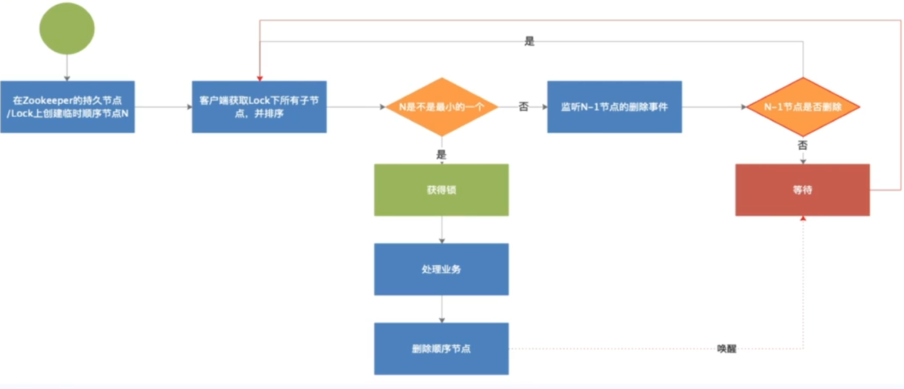

#### zookeeper实现分布式锁的结构图
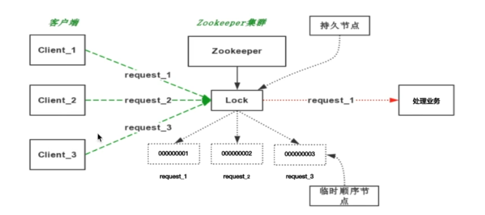

## zookeeper API
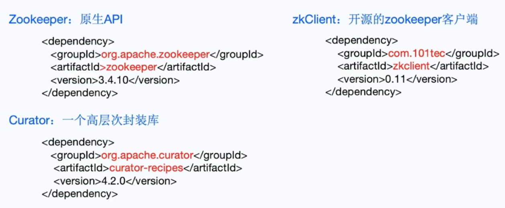

**实例化zkClient**

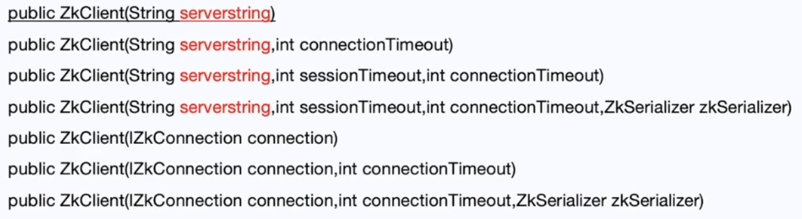

- serverstring可以指定单个服务器地址，也可以是多个(zookeeper:port, zookeeper:port)
- connection Timeout, session Timeout是连接超时时间和会话超时时间。单位都是毫秒，会话默认是30000毫秒。

